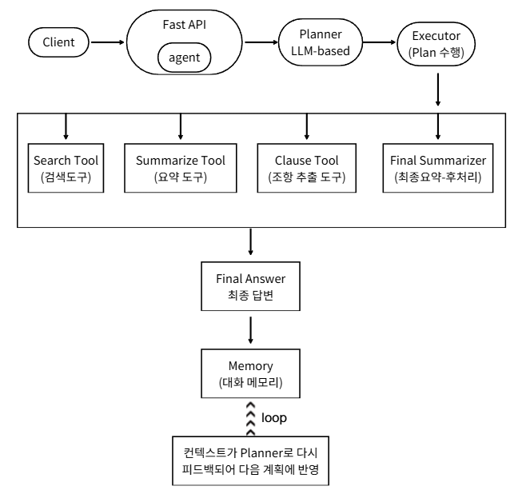

# **RulebaseAgent — 규정 기반 Tool-Using Agent (Planning → Tool-use → Multi-step)**  
Human-like Reasoning을 수행하는 Lightweight Agentic AI  

---

## **프로젝트 소개**
**RulebaseAgent**는 규정(rule)·지침·내부 문서와 같은 구조적 텍스트를 기반으로  
**Planner → Tool Execution → Memory → Multi-step Reasoning**을 수행하는 Agentic AI 실험 프로젝트입니다.

이 프로젝트는 대규모 문서 기반 시스템이나 내부 정책 조회와 같이  
“여러 도구를 조합해 문제를 해결하는 에이전트”를  
가볍고 빠르게 구현하는 것을 목표로 합니다.

---

# **핵심 기능**
### ✔ LLM 기반 Planner  
사용자 질문을 분석하여 다음 행동(JSON Plan)을 결정  
→ Search / Summarize / Clause / Final 중 선택

### ✔ 3가지 Tool  
- **SearchTool**: 규정에서 관련 내용 조회  
- **ClauseTool**: 조항 단위로 정보 추출  
- **SummarizeTool**: 다단계 결과를 자연어 최종 답변으로 변환

### ✔ Executor  
Planner가 반환한 Plan(JSON)을 받아 실제 Tool을 실행

### ✔ Memory  
최근 대화 5턴을 저장하여 context-aware Agent 동작

### ✔ FastAPI 기반 API 서비스  
- `/agent` 하나로 전체 Agent Pipeline 실행  
- Swagger로 바로 테스트 가능

---

# **아키텍처**

<p align="center">
  
</p>

위 아키텍처는 RulebaseAgent가 동작하는 전체 흐름을 나타냅니다.

1. **Client(사용자)** 가 /agent 엔드포인트로 질의를 전달  
2. **FastAPI Agent 서버**는 질의와 Memory(컨텍스트)를 함께 Planner에 전달  
3. **Planner(LLM 기반)** 는 JSON 형태의 “행동 계획(Action Plan)”을 생성  
4. **Executor** 가 Planner의 계획을 해석하고 적절한 Tool을 실행  
5. **Search / Summarize / Clause / Final Summarizer** 도구들이 상황에 따라 호출  
6. 여러 번 반복되는 loop를 통해 필요한 만큼 도구를 조합하여 추론  
7. 최종적으로 **Final Answer** 생성  
8. 답변은 **Memory**에 저장되어 다음 Planner 호출 시 context로 활용됨  
---

# **프로젝트 구조**
```bash
RulebaseAgent/
├─ app/
│   ├─ main.py # FastAPI 서버 & Agent 루프
│   ├─ config.py # OpenAI Client, MODEL_NAME
│   ├─ data/
│   │   └─ rules_sample.json
│   ├─ agent/
│   ├─ planner.py # LLM 기반 Plan 생성
│   ├─ executor.py # Tool 실행 오케스트레이션
│   ├─ memory.py # 최근 대화 N턴 저장
│   └─ tools/
│       ├─ search_tool.py
│       ├─ summarize_tool.py
│       └─ clause_tool.py
├─ requirements.txt
├─ .env
└─ README.md
```
---

# **사용 방법**

### 1) 가상환경 생성
```bash
python -m venv venv
venv\Scripts\activate
```
### 2) 패키지 설치
```python
pip install -r requirements.txt
```
### 3) 환경 변수 설정 .env
```bash
OPENAI_API_KEY=sk-xxxx
OPENAI_MODEL=gpt-5-mini
```
### 4) 서버 실행
```bash
uvicorn app.main:app --reload
```

# API 테스트
## 🔗 Swagger UI
```bash
http://127.0.0.1:8000/docs
```
```bash
요청 예시
{
  "query": "연차휴가는 1년에 며칠까지 사용할 수 있어?",
  "max_steps": 3
}
```

## 실행 결과 예시 (실제 응답)
```bash
{
  "query": "연차휴가는 1년에 며칠까지 쓸 수 있어?",
  "steps": [
    {
      "tool": "search",
      "output": [
        {
          "title": "휴가 규정",
          "content": "정규직 직원은 연간 15일의 유급 연차휴가..."
        }
      ],
      "reason": "연차 관련 규정을 조회하기 위함",
      "is_final": false
    },
    {
      "tool": "summarize (post-processing)",
      "output": "정규직 직원은 연간 15일의 유급 연차휴가를 사용할 수 있습니다.",
      "reason": "검색 결과를 최종 답변 형태로 요약",
      "is_final": true
    }
  ],
  "final_answer": "정규직 직원은 연간 15일의 유급 연차휴가를 사용할 수 있습니다."
}
```

# 기술적 구현 상세
### 1) Planner

- JSON-only Action Planning

- tool selection reasoning

- 오류 발생 시 fallback(search) 전략

### 2) Tools

- SearchTool: 규정 기반 검색

- SummarizeTool: 핵심 요약

- ClauseTool: 조항 단위 구조화

### 3) Multi-step Loop

- Planner → Executor → Tool → Loop
필요 시 여러 단계 반복

### 4) Memory 설계

- 최근 N턴 저장
→ 컨텍스트 기반 reasoning 향상

# 향후 확장 계획

- VectorDB(Qdrant/ElasticSearch) 기반 Retrieval로 확장

- Tool 개수 추가 → Multi-Agent 구조 확장

- 평가 루프(Evaluator Agent) 추가

- 대화 기반 Workflow Planning 고도화

- Role 기반 Sub-Agent 도입

# 이 프로젝트에서 배운 점

- Planner–Executor–Memory–Tool 구조 기반 Agentic Architecture 직접 구현

- gpt-5-mini 특성에 맞춘 안정화(temperature 옵션 제거)

- JSON-only 프롬프트 엔지니어링 기법 확보

- Tool-use 기반 multi-step reasoning 설계

- 규정 기반 문서 검색 + 요약 에이전트의 hybrid 구조 설계

- API 기반 Agent 서비스 개발 경험 확보
